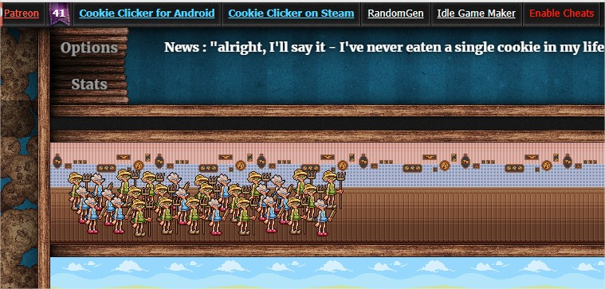

# Cookies and Tears

Cookies and Tears is an autoclicker script for [Cookie Clicker](https://orteil.dashnet.org/cookieclicker/). It was made for a YouTube video, but it does work quite well. The YouTube video can be found below:

## What It Does

The script will add an "Enable Cheats" link to the very top of the screen:

Clicking this link will enable the script. This will do the following:

* Click the cookie every 4ms.
* Look at buying an upgrade or building every 100ms.
* Click any golden cookies every 500ms.

The script will also add an additional "Speedrun Time" field next to the "Enable Cheats" button when you have baked 1 million total cookies. The script will hit 1 million cookies around 5 minutes and 40 seconds.

> _NOTE: Speedruns that use an autoclicker cannot be submitted to the leaderboards - the speedrun time was simply to know how fast the script was._ 

### Buying Upgrades and Buildings

There is some rudimentary logic behind buying upgrades and buildings. It is assumed that Upgrades are better than Buildings, and that later Upgrades/Buildings are better than earlier Upgrades/Buildings.

This means that the script will:

1. Check all upgrades from the last upgrade to the first.
    1. If an upgrade can be bought, then buy that upgrade.
    2. If an upgrade cannot be bought, then work out how many cookies we'll have in 30 seconds time based on our CPS (not our actual clicks).
    3. If we can buy the upgrade in 30 seconds, then don't buy anything and wait.
    4. If we can't buy the upgrade in the next 30 seconds, then move on to the next upgrade in the list.
2. If we're not waiting for an upgrade, and have finished with the list, then we move on to the buildings.
3. Check all buildings from the last building to the first.
    1. If we can buy a building, then continuously try to buy it until we can no longer afford it.
    2. Check if we can buy the building again in 15 seconds time.
    3. If we can buy the building in the next 15 seconds, then we wait.
    4. If we can't buy the building in the next 15 seconds, then move on to the next building in the list.

## Usage

There are two files available - CookiesAndTears.js and GreaseTamperMonkey.js. The functionality of each file is the same, but how they are used differs.

### CookiesAndTears.js

This is used by pasting it into your browser's console. You can open the developer console with F12 in Chrome and Firefox. Simply paste the contents of CookiesAndTears.js into your browser's developer console and hit enter.

More details can be found in the [Cheating section of the Wiki](https://cookieclicker.fandom.com/wiki/Cheating).

### GreaseTamperMonkey.js

Simply create a new script with either [Greasemonkey](https://addons.mozilla.org/en-US/firefox/addon/greasemonkey/) or Tampermonkey ([Chrome](https://chrome.google.com/webstore/detail/tampermonkey/dhdgffkkebhmkfjojejmpbldmpobfkfo) or [Firefox](https://addons.mozilla.org/en-US/firefox/addon/tampermonkey/)), and paste the contents of GreaseTamperMonkey.js into the script. Save it and refresh the Cookie Clicker page.